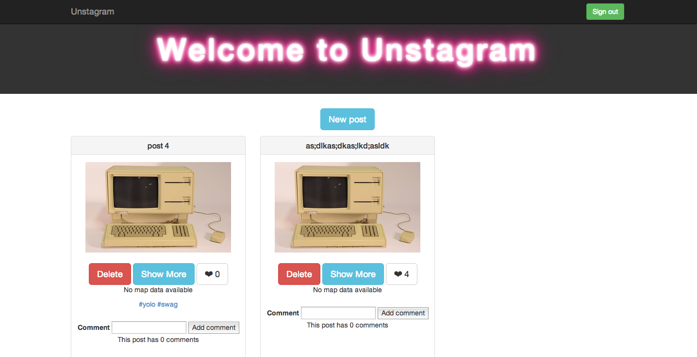

### Unstagram (instagram-clone)
====================

We´re creating an Instagram clone based on Ruby on Rails in Week 9 at Makers Academy London.


Technologies used
----
- Ruby
- Ruby on Rails
- Postgresql
- Rspec
- Capybara
- [Devise]
- [Paperclip]
- Amazon Web Services
- Bootstrap
- Git
- Heroku
- Sendgrid
- Actionmailer
- Stripe
- Websockets
- Devise
- jBuilder
- Javascript
- AJAX

How to run it
----
```
git clone git@github.com:apostoiis/unstagram.git
cd unstagram
bin/rails s
```
open your browser and go to localhost:3000

How to test it
----
```sh
cd unstagram
rspec
```

[Devise]:https://github.com/plataformatec/devise
[Paperclip]:https://github.com/thoughtbot/paperclip